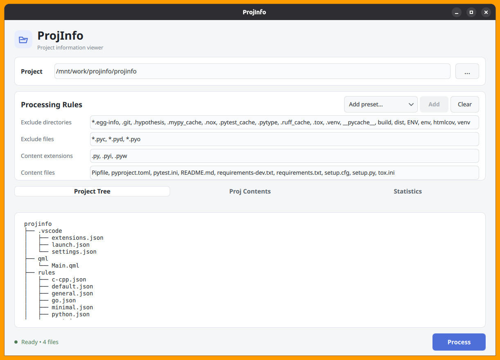
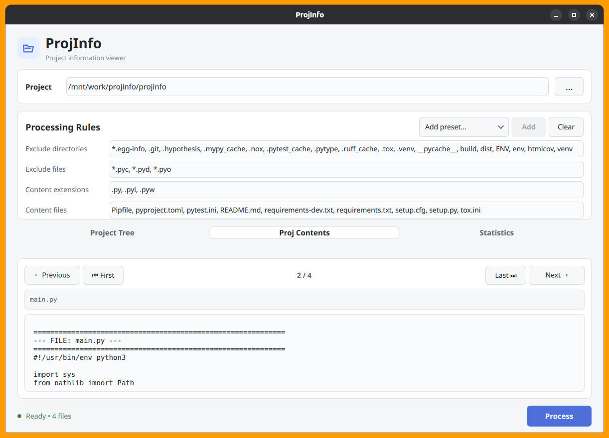
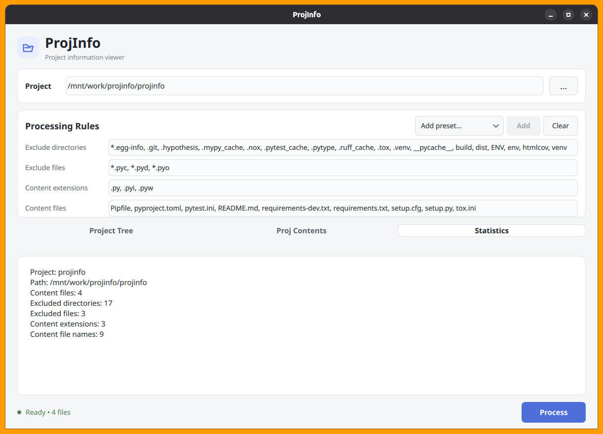

# ProjInfo

ProjInfo is a small, lightweight desktop application for inspecting and understanding a project's structure and source files.

It is particularly useful for preparing a **compact and focused representation of a software project that can be provided as context to a Large Language Model (LLM)**.

Instead of manually opening, selecting, and copying many project files, ProjInfo allows you to select a project directory and define exactly which directories, files, and file types should be included.

The resulting project information can then be copied and provided to an LLM for tasks such as code analysis, debugging, refactoring, architecture review, documentation, feature development, and understanding an unfamiliar codebase.

ProjInfo itself does **not** communicate with an LLM. It only prepares and organizes local project information so that it can be used as context with an LLM of your choice.

It is built with **Python, PySide6, Qt 6, and QML**.

ProjInfo is intentionally simple and local-first. It does not require a server, database, cloud service, or external API.

## Features

- Select a project directory using a graphical folder picker
- Display the project directory tree
- Configure processing rules
- Exclude directories
- Exclude specific files
- Configure content file extensions
- Configure specific content filenames
- Use predefined JSON-based rule presets
- Combine multiple presets
- Start with a balanced default preset
- Quickly reset rules with **Clear**
- Safely read text and source files
- Skip files that exceed the maximum file size
- Truncate excessively long text files
- Process projects in a background thread
- Cancel an active processing operation
- Browse processed project contents
- Navigate between files using **Previous**, **Next**, **First**, and **Last**
- Smoothly scroll to the selected file
- View basic project statistics
- Fixed application appearance independent of the operating system's light/dark mode
- Prepare focused project context for use with an LLM

## Screenshots







## Technology

ProjInfo uses:

- **Python**
- **PySide6**
- **Qt 6**
- **QML**
- **Qt Quick Controls**
- Python background processing

The application is designed as a small desktop utility rather than a web application.

## Requirements

- Python 3.14 or compatible Python 3 version
- PySide6
- Qt 6
- Linux / Ubuntu or another operating system supported by PySide6

## Installation

Clone the repository:

```bash
git clone <repository-url>
cd projinfo
````

Create a virtual environment:

```bash
python3 -m venv .venv
```

Activate it:

```bash
source .venv/bin/activate
```

Upgrade `pip`:

```bash
pip install --upgrade pip
```

Install the dependencies:

```bash
pip install -r requirements.txt
```

## Running

Start ProjInfo with:

```bash
python main.py
```

The application opens as a graphical desktop window.

## User Interface

The main window contains several sections.

### Project

The **Project** field contains the path of the project that should be inspected.

The `...` button opens a graphical folder-selection dialog.

The selected directory becomes the project root.

The path can also be entered manually.

### Processing Rules

The **Processing Rules** section controls which parts of the project are processed.

The available rules are:

* Excluded directories
* Excluded files
* Content extensions
* Content files

These rules can be edited directly in the interface.

### Presets

ProjInfo provides predefined processing-rule presets stored as JSON files in the `rules/` directory.

Presets are intended for common programming languages and project types.

The current presets include:

* **Default** — balanced rules for common software projects
* **General** — broader rules for general-purpose project inspection
* **Minimal** — very small rule set for lightweight inspection
* **C/C++**
* **C# / .NET**
* **Go**
* **Java**
* **PHP**
* **Python**
* **Rust**
* **TypeScript**
* **Web**

A preset can be selected and added using the **Add** button.

Multiple presets can be added sequentially.

The rules from the selected presets are **merged together**, rather than replacing the existing rules.

For example, a project containing both Python and TypeScript can use:

```text
Python + TypeScript
```

The resulting processing rules contain the relevant rules from both presets.

The **Clear** button removes the current rules and restores a minimal configuration.

## Default Preset

ProjInfo starts with the **Default** preset.

The Default preset is intentionally balanced.

It excludes common directories containing dependencies, build output, generated files, caches, and other unnecessary data while including common source and configuration files.

The purpose is to provide a useful starting point without processing every possible file type.

For projects that require more or less information, another preset can be added or the rules can be adjusted manually.

## Minimal Preset

The **Minimal** preset provides the smallest practical processing configuration.

It is useful when the user wants to inspect a project while keeping the amount of collected information as small as possible.

This can also be useful when preparing a compact context for an LLM.

## Processing

After selecting a project and configuring the processing rules, press:

```text
Process
```

ProjInfo scans the project according to the active rules.

Processing runs in the background so that the QML interface remains responsive.

While processing is active, the button changes to:

```text
Cancel
```

Pressing **Cancel** requests cancellation of the current processing operation.

The status indicator at the bottom of the application displays the current state, for example:

```text
Ready
Processing...
Cancelling...
Select project
Error
```

## Project Tree

The **Project Tree** tab displays the directory structure of the selected project.

Excluded directories and files are omitted according to the active processing rules.

For example:

```text
projinfo
├── qml
│   └── Main.qml
├── rules
│   ├── default.json
│   ├── python.json
│   └── typescript.json
├── backend.py
├── main.py
└── requirements.txt
```

This provides a quick overview of the project's organization.

## Project Contents

The **Proj Contents** tab displays the contents of the files selected by the processing rules.

The contents of the processed files are presented together and each file is identified by its relative path.

For example:

```text
--- FILE: src/main.py ---

<file contents>

--- FILE: src/utils.py ---

<file contents>
```

Navigation controls allow you to move between files using:

```text
Previous
First
Next
Last
```

When navigating to another file, ProjInfo smoothly scrolls the contents view to the corresponding file.

This makes it possible to browse a large collection of source files without manually searching through the combined content.

## Statistics

The **Statistics** tab provides information about the processed project.

Depending on the current implementation, this can include:

* Number of files
* Number of processed files
* Number of directories
* File sizes
* Content size
* Skipped files

Statistics are generated from the current processing operation.

## Processing Rules

ProjInfo uses four main types of processing rules.

### Excluded Directories

Directories that should not be scanned.

Typical examples include:

```text
.git
node_modules
.venv
__pycache__
build
dist
target
```

This prevents dependency directories, caches, build output, generated files, and version-control metadata from unnecessarily becoming part of the project context.

### Excluded Files

Specific files can be excluded from processing.

For example:

```text
package-lock.json
pnpm-lock.yaml
*.log
*.tmp
*.map
```

### Content Extensions

Files with matching extensions are treated as content files.

For example:

```text
.py
.cpp
.hpp
.rs
.go
.ts
.tsx
.js
.qml
.css
.html
```

### Content Files

Specific filenames can be included regardless of their extension.

For example:

```text
README.md
Dockerfile
Makefile
CMakeLists.txt
package.json
pyproject.toml
requirements.txt
Cargo.toml
```

This is useful for important configuration and project files whose names are meaningful but whose extensions alone do not identify them as source files.

## JSON Rules

The predefined processing rules are stored in the:

```text
rules/
```

directory.

The current rule files are:

```text
rules
├── c-cpp.json
├── csharp.json
├── default.json
├── general.json
├── go.json
├── java.json
├── minimal.json
├── php.json
├── python.json
├── rust.json
├── typescript.json
└── web.json
```

Keeping these rules in separate JSON files makes them independent from the Python backend and QML user interface.

A rule file contains information such as:

```json
{
  "name": "Python",
  "description": "Rules for Python projects.",
  "exclude_dirs": [
    ".git",
    ".venv",
    "__pycache__"
  ],
  "exclude_files": [],
  "content_extensions": [
    ".py"
  ],
  "content_files": [
    "pyproject.toml",
    "requirements.txt"
  ]
}
```

When multiple presets are added, ProjInfo merges their rules.

This makes it possible to handle projects containing multiple technologies without creating a separate preset for every possible combination.

For example:

```text
Python + TypeScript + Docker
```

can be represented by combining the corresponding presets.

## File Size Limits

ProjInfo avoids loading excessively large files into memory.

The default limits are:

```text
Maximum file size:       256 KB
Maximum text length:     32,768 characters
```

Files larger than the maximum file size are skipped.

If a file is within the file-size limit but its text content exceeds the maximum character limit, the content is truncated.

This prevents unexpectedly large files from consuming excessive memory or generating unnecessarily large LLM context.

## Using ProjInfo with an LLM

A primary use case for ProjInfo is preparing **project context for an LLM**.

When working with an unfamiliar codebase, an LLM often needs information from multiple files at the same time.

For example, understanding a feature may require:

```text
Project structure
        +
Source files
        +
Configuration files
        +
Related modules
```

Manually collecting this information can be time-consuming and can easily result in either too little context or a large amount of irrelevant information.

ProjInfo helps solve this by allowing the user to define what should be included.

### Reducing Unnecessary Context

A software project may contain many files that are not useful to an LLM:

```text
.git/
node_modules/
.venv/
build/
dist/
target/
__pycache__/
```

Including these files would add noise and unnecessarily increase the amount of context.

Processing rules allow ProjInfo to remove this noise before the project information is given to an LLM.

### Example: Python Project

A Python project might use:

```text
.py
README.md
pyproject.toml
requirements.txt
```

while excluding:

```text
.git
.venv
__pycache__
```

### Example: TypeScript/Web Project

A TypeScript/Web project might use:

```text
.ts
.tsx
.js
.jsx
.html
.css
.json
```

while excluding:

```text
node_modules
dist
build
```

### Combining Technologies

Real-world projects often contain multiple technologies.

For example:

```text
Python + TypeScript + Docker
```

ProjInfo can combine the corresponding presets so that the resulting project context contains relevant files from all three technologies.

### Typical LLM Tasks

The resulting project context can be useful when asking an LLM to:

* Explain the project architecture
* Explain how components are connected
* Find bugs
* Review source code
* Refactor code
* Add a new feature
* Explain a particular module
* Review an API
* Analyze dependencies
* Suggest architectural improvements
* Generate documentation
* Help migrate code to another technology
* Investigate an error
* Understand an unfamiliar codebase

### ProjInfo Does Not Use an LLM

ProjInfo does **not** communicate with an LLM.

It does not require:

* OpenAI API
* Anthropic API
* Google API
* Ollama
* Internet access
* A remote server

ProjInfo only prepares local project information.

The user can then provide that information to any LLM or AI coding assistant that they choose.

## Privacy

ProjInfo processes the selected project locally.

Project files are not uploaded to a remote service by ProjInfo.

This makes the application suitable for projects containing source code or other information that should remain on the local machine.

However, users should review the collected project information before providing it to an external LLM or AI service, since the resulting context may contain source code, configuration files, paths, or other project information.

## Desktop Launcher on Ubuntu

ProjInfo can be launched like a normal desktop application using a `.desktop` launcher.

For example:

```ini
[Desktop Entry]
Type=Application
Name=ProjInfo
Comment=Project information viewer

Exec=/path/to/projinfo/.venv/bin/python /path/to/projinfo/main.py
Path=/path/to/projinfo

Icon=application-x-executable
Terminal=false

Categories=Development;Utility;
StartupNotify=true
```

Save the file as:

```text
projinfo.desktop
```

Make it executable:

```bash
chmod +x projinfo.desktop
```

On GNOME/Ubuntu, the first launch may require selecting **Allow Launching** from the file's context menu.

## Project Structure

The current repository structure is:

```text
projinfo
├── .vscode
│   ├── extensions.json
│   ├── launch.json
│   └── settings.json
├── images
│   ├── screenshot-1.jpg
│   ├── screenshot-2.jpg
│   └── screenshot-3.jpg
├── qml
│   └── Main.qml
├── rules
│   ├── c-cpp.json
│   ├── csharp.json
│   ├── default.json
│   ├── general.json
│   ├── go.json
│   ├── java.json
│   ├── minimal.json
│   ├── php.json
│   ├── python.json
│   ├── rust.json
│   ├── typescript.json
│   └── web.json
├── .gitignore
├── backend.py
├── LICENSE
├── main.py
├── README.md
└── requirements.txt
```

### Main Components

* `main.py` — application entry point
* `backend.py` — project scanning, processing, rule handling, preset loading, and backend logic
* `qml/Main.qml` — graphical user interface
* `rules/` — predefined JSON processing-rule presets
* `images/` — screenshots used by the README
* `requirements.txt` — Python dependencies
* `LICENSE` — MIT license
* `README.md` — project documentation

## License

ProjInfo is licensed under the MIT License.

See the [LICENSE](LICENSE) file for the complete license text.

